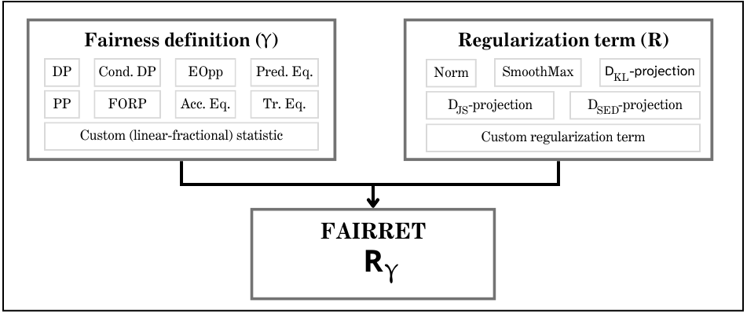

.. fairret documentation master file, created by
   sphinx-quickstart on Tue Mar 26 11:52:28 2024.
   You can adapt this file completely to your liking, but it should at least
   contain the root `toctree` directive.

Welcome to fairret's documentation!
===================================

The goal of fairret is to serve as an open-source Python library for measuring and mitigating statistical fairness in PyTorch models. The library is designed to be 

1. *flexible* in how fairness is defined and pursued.
2. *easy* to integrate into existing PyTorch pipelines.
3. *clear* in what its tools can and cannot do.

The central to the library is the paradigm of the *fairness regularization term* (fairrets) that quantify unfairness as differentiable PyTorch loss functions. 
These can then be optimized together with e.g. the binary cross-entropy error such that the classifier improves both its accuracy and fairness.

.. note::

   This project is under active development!

.. toctree::
   :maxdepth: 3
   :titlesonly:
   :caption: Contents:

   loss
   statistic
   metric

Citation
--------

If you have found fairret useful in your research, please cite our ICLR 2024 paper_ :

.. _paper: https://openreview.net/pdf?id=NnyD0Rjx2B

.. code-block:: console

   @inproceedings{buyl2024fairret,
   title={fairret: a Framework for Differentiable Fairness Regularization Terms},
   author={Buyl, Maarten and Defrance, Marybeth and De Bie, Tijl},
   booktitle={International Conference on Learning Representations},
   year={2024}
}

Indices and tables
----------------------

* :ref:`genindex`
* :ref:`modindex`
